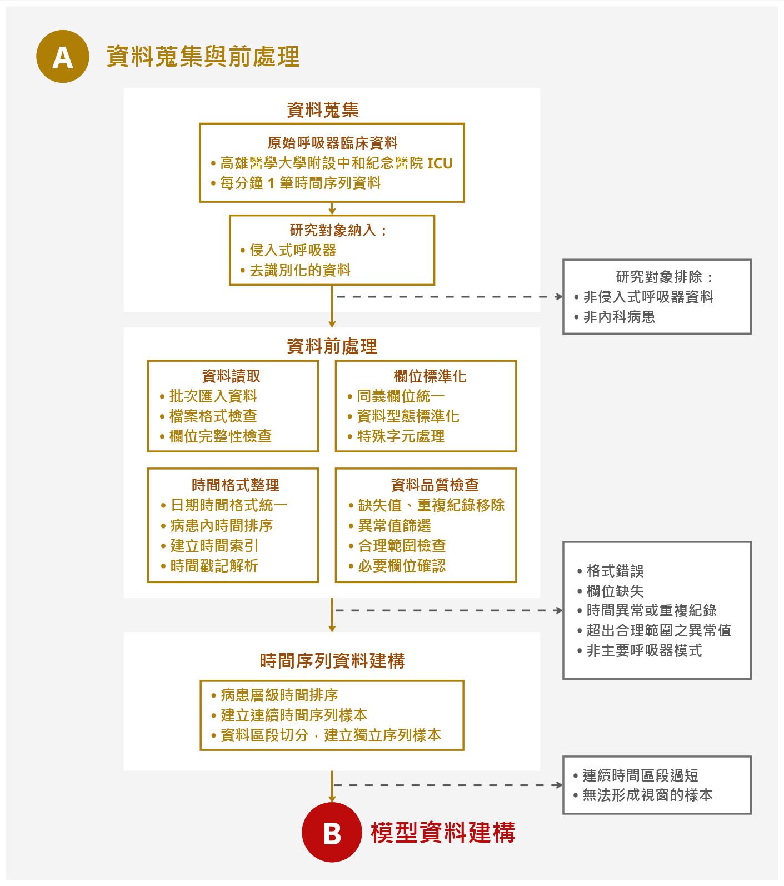

# Data Preprocessing Pipeline

由於重症加護病房的呼吸器原始資料來自實際臨床照護，資料可能存在欄位命名不一致、時間格式不同、缺失值、重複時間戳記、資料中斷及不同資料來源格式混用等情形。為建立可供後續事件定義與模型建構的時間序列資料，本研究依序進行研究對象納入與排除、資料讀取與格式統一、時間欄位整理、資料品質檢核、呼吸器模式整理及時間序列整理等程序，整體資料前處理流程如下圖所示。

---

## 前處理流程圖

  

  
    <strong>版權宣告：</strong> 本圖表與內容受著作權保護，<strong>不得任意轉載或使用</strong>。若需引用或參考，請務必明確標註作者。
  

---

## 處理步驟與核心邏輯

### 1. 資料格式統一與欄位標準化
原始資料包含 CSV 與 Excel 兩種格式，採批次方式讀取。為降低不同來源資料於欄位名稱、編碼格式及資料格式上的差異，本研究首先進行欄位名稱標準化，包括欄位大小寫統一、空白及特殊符號移除、欄位別名整併及資料格式統一，讓有相同臨床意義但名稱不同的欄位皆轉換為一致命名。

### 2. 時間欄位解析與序列建構
在時間欄位整理方面，本研究將原始時間資料統一進行時間格式解析與標準化處理。部分原始資料亦存在不同日期表示方式、12 小時制與 24 小時制混用，以及中文上午與下午標記等情形，因此在前處理統一進行時間格式解析與標準化處理。完成時間格式標準化後，所有資料皆依據原始時間戳記進行排序，並於病患層級內依時間先後順序建立連續時間序列資料，維持不同時間點間呼吸器模式、呼吸器設定參數與病患反應的時間相依性。

### 3. 資料品質檢核與異常值篩選
時間資訊整理後，本研究進行資料品質檢核，確認資料可作為時間序列分析的基礎。對於缺失值、空白字串或不同形式的空值表示方式，皆統一轉換為標準缺漏格式處理；重複時間戳記則依據資料內容是否完全一致進行檢查，若資料內容完全相同則保留單一紀錄。針對主要呼吸器設定參數與監測參數，本研究進行資料品質檢核與異常值篩選，對於超出合理範圍、必要欄位缺失、模式編碼異常，或長時間不連續的資料，則進行標記或排除，以降低不完整資料對時間序列分析的影響。主要參數異常值篩選條件則整理如表 3.3 所示。所有資料前處理程序皆以程式化方式執行，確保不同資料皆採用一致地處理流程。

---

## 程式碼檔案

> **Notice:** 相關前處理程式碼檔案（包含多份 `.py` 腳本）預計將於 **9月底** 正式掛上與更新。

---

Copyright © 2026 Sha Huang. All Rights Reserved.  
嚴禁未經授權之複製、轉載或商業使用。若有引用請務必標註作者。

