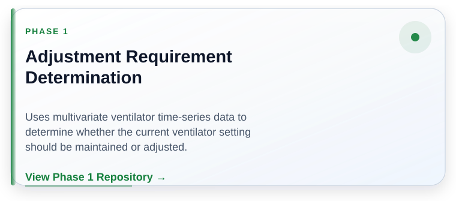
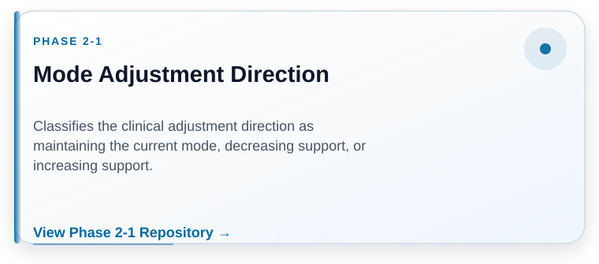
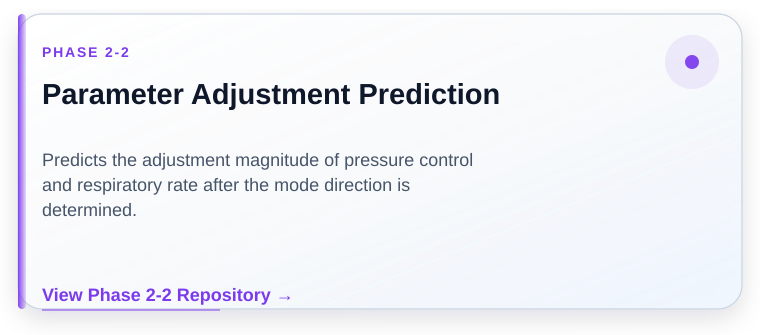

# ICU Mechanical Ventilator Adjustment

### A Three-Phase Clinical Decision Framework Based on Multivariate Time-Series Analysis

 

This project learns clinical ventilator adjustment patterns from
multivariate time-series data and predicts three sequential decisions:
adjustment requirement, mode adjustment direction, and parameter
adjustment magnitude.

 

[Research Framework](#research-framework) ·
[Data Preparation](#data-preparation) ·
[Model Development](#model-development) ·
[Decision Framework](#three-phase-decision-framework) ·
[Master Thesis](#master-thesis)

---

## Research Components

<table>
  <tr>
    <td width="33%" align="center">
      
    </td>
    <td width="33%" align="center">
      
    </td>
    <td width="33%" align="center">
      
    </td>
  </tr>
</table>

<table>
  <tr>
    <td width="16%"></td>
    <td width="34%" align="center">
      
    </td>
    <td width="34%" align="center">
      
    </td>
    <td width="16%"></td>
  </tr>
</table>

---

## Research Framework

The research workflow begins with ICU mechanical ventilator data
collection, quality review, temporal organization, and multivariate
time-series construction.

Phase-specific samples are subsequently generated through adjustment
event definition, mode-transition identification, temporal sequence
construction, and task-specific inclusion criteria.

LSTM and GRU models are trained and optimized to learn the clinical
ventilator adjustment workflow. The resulting models support three
connected decisions: determining the need for adjustment, classifying
the direction of mode adjustment, and predicting the magnitude of
parameter adjustment.

  

  
    Overall research workflow integrating data preparation,
    time-series construction, model development, the three-phase
    decision process, and model evaluation.
  

---

## Data Preparation

The data preparation workflow was designed separately for each
decision task while maintaining a consistent sequence-based modeling
strategy.

- Clinical data quality review and abnormal-value handling
- Temporal segmentation and independent sample construction
- Adjustment-event and mode-transition identification
- Phase-specific inclusion and exclusion criteria
- Sliding-window multivariate time-series generation
- Task-specific label and prediction-target construction

Clinical source data and patient-level records are not distributed
through this repository.

---

## Model Development

The model-development workflow includes:

- multivariate time-series input construction;
- LSTM and GRU recurrent neural network modeling;
- Bayesian hyperparameter optimization using the
  Tree-structured Parzen Estimator;
- repeated independent train-test data splitting;
- stage-specific model selection; and
- classification- or regression-specific evaluation.

This workflow evaluates both sequence-model architecture and
hyperparameter configuration before selecting the final models for
each decision task.

---

## Three-Phase Decision Framework

<table>
  <tr>
    <td width="33%" valign="top">
      <h3>Phase 1</h3>
      <strong>Adjustment Requirement Determination</strong>
        
      Determines whether the current mechanical ventilator setting
      should be maintained or adjusted.
    </td>
    <td width="33%" valign="top">
      <h3>Phase 2-1</h3>
      <strong>Mode Adjustment Direction</strong>
        
      Classifies the adjustment strategy as maintaining the current
      mode, decreasing ventilator support, or increasing support.
    </td>
    <td width="33%" valign="top">
      <h3>Phase 2-2</h3>
      <strong>Parameter Adjustment Prediction</strong>
        
      Predicts the adjustment magnitude for pressure control and
      respiratory rate after the adjustment direction is determined.
    </td>
  </tr>
</table>

---

## Phase Repositories

<table>
  <tr>
    <td width="33%" align="center">
      
    </td>
    <td width="33%" align="center">
      
    </td>
    <td width="33%" align="center">
      
    </td>
  </tr>
</table>

---

## Master Thesis

**Applying Deep Learning Methods to Mechanical Ventilator Adjustment
in the Intensive Care Unit**

Master's thesis, July 2026.

The official National Digital Library of Theses and Dissertations in
Taiwan record will be linked here after publication.

---

## Citation

When referencing this research portfolio, use:

> Huang, S. (2026). *ICU Mechanical Ventilator Adjustment: A Three-Phase
> Clinical Decision Framework Based on Multivariate Time-Series Analysis*
> [Research portfolio]. GitHub.  
> https://github.com/hiimsharon/icu-ventilator-adjustment

Citation identifies and acknowledges this research. Citation does not
grant permission to reproduce, modify, redistribute, adapt, or
incorporate protected materials into another research project.

---

## Research Portfolio Notice

Clinical source data and patient-level records are not distributed
through this repository.

Academic, educational, non-commercial, or research use does not by
itself grant permission to reproduce, modify, adapt, redistribute, or
incorporate protected materials into another work.

Public access, citation, forking, cloning, or downloading does not
grant permission to reuse figures, visualizations, workflow diagrams,
interface designs, documentation, source code, trained models, or
other protected research materials.

See:

- [Terms of Use](TERMS_OF_USE.md)
- [Copyright Notice](COPYRIGHT.md)
- [Research and Use Notice](NOTICE.md)
- [Citation Metadata](CITATION.cff)

---

Copyright © 2026 Sha Huang. All Rights Reserved.

No permission is granted for reuse in research publications, theses,
dissertations, academic projects, commercial products, model training,
or derivative works without prior written permission.

