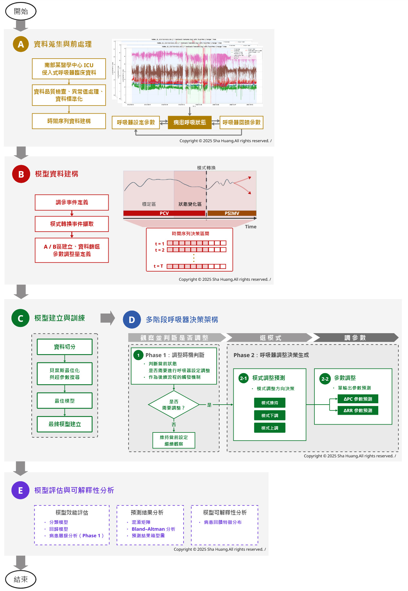

# ICU Mechanical Ventilator Adjustment

### A Three-Phase Clinical Decision Framework Based on Multivariate Time-Series Analysis

 

This project implements a multi-phase clinical decision framework
designed to model and predict mechanical ventilator adjustment workflows
in intensive care units using multivariate time-series data.

 

[Research Scope](#research-scope) ·
[Research Highlights](#research-highlights) ·
[Research Framework](#research-framework) ·
[Methodology & Code](#methodology--data-preprocessing) ·
[Phase Repositories](#phase-repositories) ·
[Master Thesis](#master-thesis) ·
[Citation & References](#citation--references)

---

## Research Scope

This research investigates high-acuity clinical environments within the Intensive Care Unit (ICU), focusing on the computational modeling of mechanical ventilator parameter adjustments. By synthesizing multivariate ventilator telemetry and setting streams, the framework captures complex temporal dynamics to assist clinical decision-making.

The methodological backbone integrates deep sequence modeling—specifically employing Long Short-Term Memory (LSTM) and Gated Recurrent Unit (GRU) architectures—coupled with rigorous hyperparameter optimization via the Tree-structured Parzen Estimator (TPE) to ensure robust generalization across clinical cohorts.

---

## Research Highlights

<table>
  <tr>
    <td width="33%" valign="top">
      <h3>Clinical Workflow Modeling</h3>
      Learns and predicts the sequential decision logic utilized by
      clinicians during mechanical ventilation management.
    </td>
    <td width="33%" valign="top">
      <h3>Multivariate Temporal Analysis</h3>
      Captures complex dynamic interactions among ventilator settings,
      patient physiological responses, and adjustment milestones.
    </td>
    <td width="33%" valign="top">
      <h3>Rigorous Optimization</h3>
      Employs Bayesian optimization frameworks to systematically search
      and stabilize network hyperparameter configurations.
    </td>
  </tr>
</table>

---

## Research Framework

The research architecture integrates data preprocessing, phase-specific
sample formulation, sequence modeling, and decision evaluation into a
cohesive pipeline. 

Continuous ICU monitoring streams are structured into temporal intervals
to predict three progressive clinical objectives: determining adjustment
necessity, forecasting adjustment direction, and recommending precise
parameter values.

  

  
    Systematic pipeline of temporal data processing, sequence generation,
    three-phase decision modeling, and validation.
  

---

## Methodology & Data Preprocessing

### Data Pipeline Overview

The retrospective dataset comprises high-frequency telemetry and setting
records from **355 patients** undergoing invasive mechanical ventilation,
totaling **11,298,127 minutes** of multivariate time-series observations.

> **📂 Data Preprocessing Codebase:**
> Because the data engineering pipeline involves multiple modular scripts handling signal filtering, anomaly cleaning, and window slicing across diverse operational paths, the complete collection of preprocessing Python scripts (`.py`) and execution guidelines are documented in **[PREPROCESSING.md](PREPROCESSING.md)**.

<table>
  <tr>
    <td width="33%" valign="top">
      <h3>Data Processing</h3>
      Filters signal anomalies, handles missing intervals, aligns
      temporal timestamps, and encodes ventilator modes.
    </td>
    <td width="33%" valign="top">
      <h3>Sample Formulation</h3>
      Defines event boundaries, isolates transition states, and constructs
      independent training windows tailored to each phase.
    </td>
    <td width="33%" valign="top">
      <h3>Sequence Generation</h3>
      Constructs sliding-window tensors mapped to task-specific
      classification labels and regression targets.
    </td>
  </tr>
</table>

#### Dataset Profile and Quality Metrics

<table>
  <tr>
    <td width="30%"><strong>Category</strong></td>
    <td width="40%"><strong>Metric Description</strong></td>
    <td><strong>Quantitative Value</strong></td>
  </tr>
  <tr>
    <td rowspan="2"><strong>Cohort Scale</strong></td>
    <td>Total Patient Cohort</td>
    <td>355 patients</td>
  </tr>
  <tr>
    <td>Raw Time-Series Observations</td>
    <td>11,298,127 records</td>
  </tr>
  <tr>
    <td rowspan="2"><strong>Data Integrity</strong></td>
    <td>Available Data Ratio</td>
    <td>80.89%</td>
  </tr>
  <tr>
    <td>Unavailable / Masked Interval Ratio</td>
    <td>19.11%</td>
  </tr>
  <tr>
    <td rowspan="2"><strong>Event Distribution</strong></td>
    <td>Adjustment Interval Ratio</td>
    <td>0.81%</td>
  </tr>
  <tr>
    <td>Non-Adjustment Interval Ratio</td>
    <td>99.19%</td>
  </tr>
</table>

 

#### IRB Approval & Data Governance Statement

> **Institutional Review Board (IRB) Notice:**
> This study was approved by the Institutional Review Board of Kaohsiung Medical University Chung-Ho Memorial Hospital (Approval No.: KMUHIRB-E(I)-20240420).
> 
> * **Data Privacy & Confidentiality:** Clinical source records, patient-level identifiers, and institutional materials contain sensitive medical information protected under clinical governance frameworks.
> * **Non-Open Source Policy:** This repository is maintained strictly for academic research verification. **It is not an open-source software project for general public reuse.**
> * **Access & Inquiry Protocol:** Public access to this repository does not grant reproduction, modification, or distribution rights. Any academic utilization, replication inquiry, or data access request **must be communicated to and approved by the author in advance**.
> * **Authorized Archives:** Processed, non-identifiable sample archives are securely hosted via the [Project Releases Page](https://github.com/hiimsharon/icu-ventilator-adjustment/releases). Comprehensive guidelines are documented in [DATA.md](DATA.md).

 

### Model Development

<table>
  <tr>
    <td width="33%" valign="top">
      <h3>Sequence Modeling</h3>
      Implements deep recurrent networks (LSTM and GRU) optimized
      for clinical multivariate forecasting.
    </td>
    <td width="33%" valign="top">
      <h3>Hyperparameter Tuning</h3>
      Applies TPE-based Bayesian optimization to balance convergence
      speed and generalization error.
    </td>
    <td width="33%" valign="top">
      <h3>Model Selection</h3>
      Evaluates candidate checkpoints across independent cross-validation
      folds using task-specific objective metrics.
    </td>
  </tr>
</table>

 

### Model Evaluation

Classification performance is assessed via accuracy, precision, recall,
F1-score, and area under the ROC curve (AUROC). Regression performance
for parameter recommendation is evaluated using agreement and error
metrics suited to physiological target distributions.

Evaluation protocols are independently structured for each phase to
maintain alignment with specific clinical decision milestones.

---

## Phase Repositories

<table>
  <tr>
    <td width="33%" valign="top">
      <h3>Phase 1</h3>
      <strong>Adjustment Requirement Determination</strong>
        
      Binary classification determining whether ventilator adjustments
      are required at the current time step.
        
      <a href="https://github.com/hiimsharon/icu-ventilator-phase-1">
        View Phase 1 Repository →
      </a>
    </td>
    <td width="33%" valign="top">
      <h3>Phase 2-1</h3>
      <strong>Adjustment Direction Prediction</strong>
        
      Multi-class prediction isolating the trajectory of parameter
      modifications following trigger confirmation.
        
      <a href="https://github.com/hiimsharon/icu-ventilator-phase-2-1">
        View Phase 2-1 Repository →
      </a>
    </td>
    <td width="33%" valign="top">
      <h3>Phase 2-2</h3>
      <strong>Parameter Adjustment Recommendation</strong>
        
      Regression-based modeling providing optimal quantitative targets
      for ventilator control settings.
        
      <a href="https://github.com/hiimsharon/icu-ventilator-phase-2-2">
        View Phase 2-2 Repository →
      </a>
    </td>
  </tr>
</table>

---

## Master Thesis

**應用深度學習方法於加護病房呼吸器調參之研究**

Applying Deep Learning Techniques for Mechanical Ventilator Parameter Adjustment in the ICU

**Author:** 黃筱雯（2026）

Kaohsiung Medical University

**[View Official Thesis Record →](https://hdl.handle.net/11296/7442av)**

---

## Citation & References

### Academic Citation

If you reference this research framework or related materials, please cite the master's thesis:

> 黃筱雯（2026）。《應用深度學習方法於加護病房呼吸器調參之研究》。高雄醫學大學碩士論文。https://hdl.handle.net/11296/7442av

 

### Reference Access

Complete bibliographic references are cataloged within the formal thesis document.

**[Access Thesis and References →](https://hdl.handle.net/11296/7442av)**

 

### Embargoed Access Notice

If full-text access is restricted during the institutional embargo period,
please consult the library guidelines provided by Kaohsiung Medical University.

**[University Library Guidelines →](https://olis.kmu.edu.tw/index.php/zh-TW/lib-faq/10-)**

---

## Research Portfolio Notice

Clinical data pipelines and model assets are proprietary to the primary
researcher. Public visibility does not constitute an open-source or permissive
license grant.

Academic discussions or citations must explicitly attribute **Sha Huang**,
the study title, the publication year (**2026**), and reference the core
repository link. 

Detailed governance policies are available in:

- [Terms of Use](TERMS_OF_USE.md)
- [Copyright Notice](COPYRIGHT.md)
- [Research and Use Notice](NOTICE.md)

---

Copyright © 2026 Sha Huang. All Rights Reserved. 
Restricted to authorized academic research validation.

